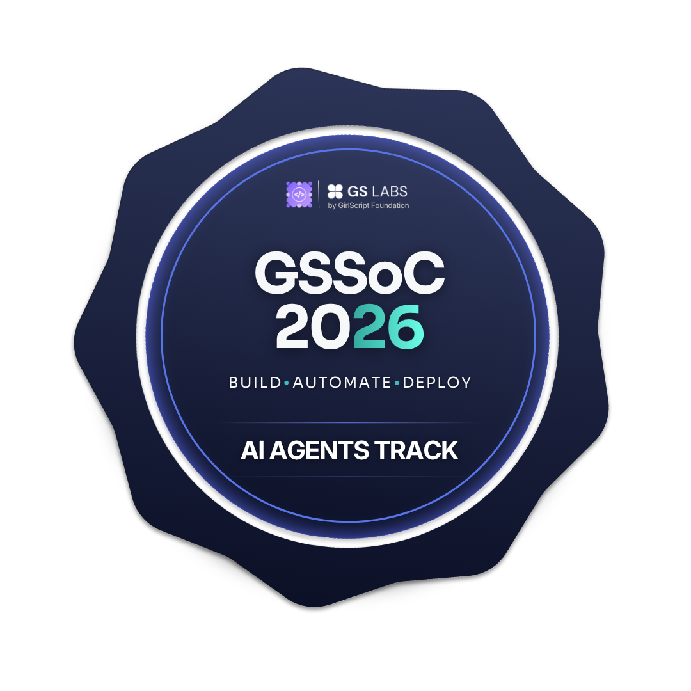

<h1 align="center">Abel Jean Pool Saldaña Porras</h1>

<p align="center">
  
</p>

<p align="center">
  <a href="mailto:abelsaldanap@gmail.com"></a>
  <a href="https://linkedin.com/in/asaldanadev"></a>
  <a href="https://abel-dev-portfolio-seven.vercel.app/"></a>
  <a href="https://gitlab.com/asaldanadev"></a>
</p>

---

## 🏆 Logros Recientes

<p align="center">
  <a href="https://gssoc.girlscript.org/profile/f496dc36-c055-4635-ac45-7027582e1600">
    
  </a>
  &nbsp;&nbsp;
  <a href="https://gssoc.girlscript.org/profile/f496dc36-c055-4635-ac45-7027582e1600">
    
  </a>
  &nbsp;&nbsp;
  <a href="https://gssoc.girlscript.org/profile/f496dc36-c055-4635-ac45-7027582e1600">
    
  </a>
</p>

<p align="center">
  <strong><a href="https://gssoc.girlscript.org/profile/f496dc36-c055-4635-ac45-7027582e1600">GirlScript Summer of Code 2026 — Contributor Seleccionado</a></strong><br>
  Participando activamente en las pistas de <b>Open Source</b> e <b>IA Agents</b>.<br>
  <i>Mayo 2026 – Presente</i>
</p>

---

## <picture></picture> Sobre mí

Soy **Full Stack Engineer y Analista Programador** con experiencia real en entornos de producción, especializado en el desarrollo de aplicaciones web empresariales. Me enfoco en construir sistemas escalables, APIs robustas y código limpio con impacto directo en el negocio.

```
🏢  Experiencia en producción real                 → Sistemac34, Huancayo
⚙️  Backend-first con visión full stack            → Laravel · Vue.js · Next.js · Node.js
🔗  Diseño e implementación de APIs REST           → Módulos empresariales
☁️  Experiencia con servicios cloud                → AWS · Azure
📊  Optimización SQL y gestión de bases de datos   → MySQL · SQL Server
🧱  Arquitectura limpia y buenas prácticas         → MVC · SOLID · Clean Code
🎨  Diseño y maquetación web                       → HTML · CSS · Bootstrap · Tailwind
🤖  Integración de IA y automatización             → Python · OpenAI API
🤝  Trabajo colaborativo y metodologías ágiles     → Git · Scrum
🌐  Idiomas                                        → Español nativo · Inglés técnico
```

> 📌 **Disponible para nuevos proyectos.** Busco un equipo donde pueda aportar valor técnico real y seguir creciendo como desarrollador.

---

## 🛠️ Stack Tecnológico

### Backend


### Frontend


### Bases de Datos


### Cloud & DevOps


### Herramientas


### Metodologías


### Seguridad & Auth


### IA & Automatización


### Diseño


---

## 💼 Experiencia Laboral

### 🏢 Desarrollador Full Stack | Analista Programador — Sistemac34
📍 **Mar 2025 – Abr 2026** &nbsp;|&nbsp; Huancayo, Perú

- ⚙️ Desarrollo y mejora continua de plataforma contable **100% web** en producción con **Laravel** y **Vue.js**
- 🔗 Implementación de **APIs REST** para integración de módulos y procesos del sistema
- ☁️ Uso de servicios cloud **AWS** y **Azure** dentro de la infraestructura del sistema
- 📊 Optimización de consultas críticas en **MySQL** y **SQL Server**, mejorando tiempos de respuesta
- 🧱 Desarrollo bajo arquitectura **MVC** aplicando buenas prácticas y clean code
- 🔄 Mantenimiento, evolución y escalabilidad de plataforma empresarial activa
- 🤝 Colaboración con equipo de desarrollo y QA bajo metodología **Scrum**
- 🔍 Análisis de requerimientos y propuesta de soluciones para mejorar eficiencia de procesos

### 🏫 Practicante de Docencia y Desarrollo Web — I.E.P Jesús Nazareno
📍 **May 2024 – Oct 2024** &nbsp;|&nbsp; Hualhuas, Perú

- 👨‍🏫 Enseñanza de fundamentos de computación a estudiantes de primaria (1° a 6° grado)
- 🌐 Desarrollo del **sitio web institucional**, mejorando la presencia digital de la institución
- 🎯 Optimización de usabilidad y estructura del sitio web

### 💻 Practicante de Desarrollo de Aplicaciones Web — SISTEMAS & S SAC
📍 **Jul 2023 – Nov 2023** &nbsp;|&nbsp; Huancayo, Perú

- 🔨 Desarrollo de sitio web con **PHP**, **HTML**, **CSS**, **JavaScript** y **MySQL**
- 🧩 Código estructurado bajo buenas prácticas de desarrollo
- 📝 Gestión y actualización de contenidos mediante **WordPress**

---

## 🎓 Formación Académica

| Carrera | Instituto |
|---|---|
| 🎓 Diseño y Programación Web | I.E.S.T.P. Andrés Avelino Cáceres Dorregaray |

---

## 🌐 Portfolio

<p align="center">

Sitio personal con diseño moderno, sistemas de alto rendimiento y arquitectura orientada a conversión.

</p>

<div align="center">

**🔬 Lighthouse Score — Escritorio**

| ⚡ Rendimiento | ♿ Accesibilidad | ✅ Recomendaciones | 🔍 SEO |
|:-:|:-:|:-:|:-:|
|  |  |  |  |

**⏱️ Core Web Vitals**

| FCP | LCP | TBT | CLS |
|:-:|:-:|:-:|:-:|
|  |  |  |  |

</div>

<p align="center">


[](https://abel-dev-portfolio-seven.vercel.app/)

</p>

---

## 🧠 Actualmente profundizando en

| Área | Tecnología / Concepto |
|---|---|
| 🤖 IA & Automatización | OpenAI API · Python · Integración de modelos |
| 🏗️ Arquitectura | Clean Architecture · Domain-Driven Design (DDD) |
| 🔐 Seguridad | JWT · Laravel Sanctum · Buenas prácticas en APIs |
| ☁️ Cloud | AWS · Azure · Docker · Despliegue de aplicaciones |
| 🧪 Calidad | Testing · TDD · Buenas prácticas |
| ⚡ Performance | Optimización avanzada SQL · Caché · Indexación |

---

## 📊 Estadísticas GitHub

<!-- <p align="center">
  
  &nbsp;
  
</p> -->

<p align="center">
  
</p>

---

## 🐍 Contribution Snake

<p align="center">
  <picture>
    <source media="(prefers-color-scheme: dark)" srcset="https://raw.githubusercontent.com/asaldanadev/asaldanadev/output/github-contribution-grid-snake-dark.svg" />
    <source media="(prefers-color-scheme: light)" srcset="https://raw.githubusercontent.com/asaldanadev/asaldanadev/output/github-contribution-grid-snake.svg" />
    
  </picture>
</p>

---

## 📬 Contacto

<p align="center">
  <a href="mailto:abelsaldanap@gmail.com"></a>
  <a href="https://linkedin.com/in/asaldanadev"></a>
  <a href="https://gitlab.com/asaldanadev"></a>
  <a href="https://abel-dev-portfolio-seven.vercel.app/"></a>
</p>

<p align="center">
  
</p>

---

<p align="center">
  <i>"Cualquiera puede hacer que funcione. La diferencia está en hacerlo sostenible."</i><br/>
  <sub>— Abel Saldaña</sub>
</p>
